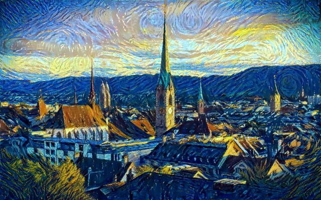

# Neural Style Transfer

<table>
  <tr>
    <td align="center"> content image</td>
    <td align="center"> style image</td>
    <td align="center"> combined image</td>
  </tr>
</table>

This implementation is very simple. You can read this [paper](https://arxiv.org/pdf/1508.06576) for more details.Higher resolution images produce better style transfer effects. You can download some clear and interesting content images and style images from [here](https://kaggle.com/datasets/ba7c7744279baffacf006c34a28d87e873c1187f9e947b66416f6e9778b280a8).
